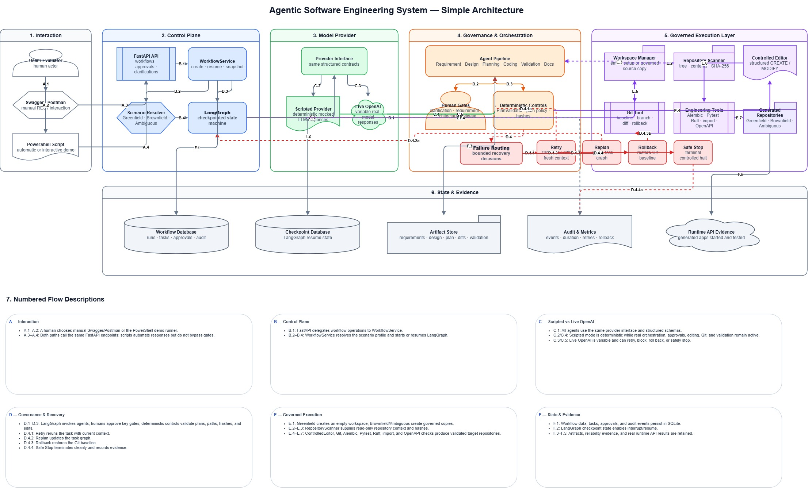
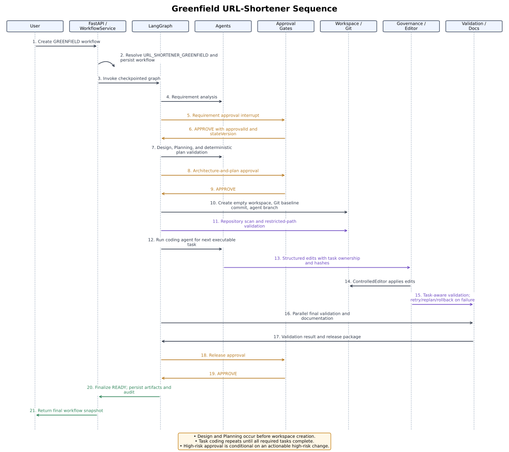
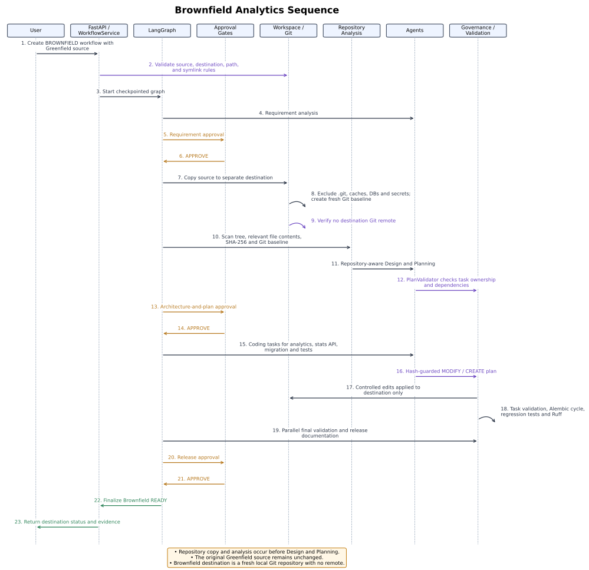
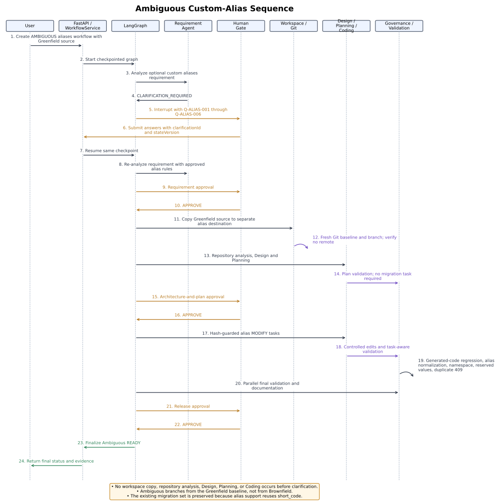

# Final Evidence Summary

This page provides a concise visual overview of the system and points reviewers to the detailed
engineering documentation when more depth is needed.

## Architecture diagram

## Scenario sequence diagrams

### Greenfield

### Brownfield

### Ambiguous requirement

## Key results

- The Greenfield scenario completed its governed workflow and reached release readiness.
- The Brownfield scenario exercised repository-aware analysis and controlled changes.
- The Ambiguous scenario demonstrated clarification pause and durable resume behavior.
- The final verification run completed with 259 tests passed and 3 skipped, with Ruff and
  whitespace validation passing.

## Detailed references

- [API and Schema Contracts](api-and-schema-contracts.md)
- [Architecture Overview](architecture-overview.md)
- [Final Engineering Summary](final-engineering-summary.md)
- [Interactive Benchmark Reliability](interactive-benchmark-reliability.md)
- [Orchestration Model](orchestration-model.md)
- [Risks, Trade-offs, and Limitations](risks-tradeoffs-limitations.md)
- [Testing and Validation](testing-and-validation.md)
